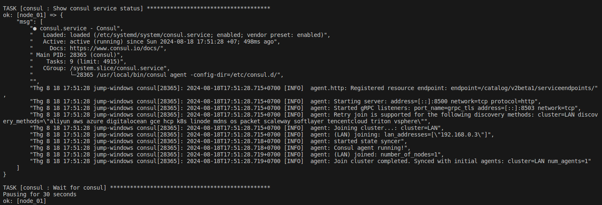
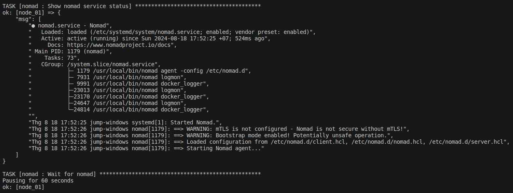
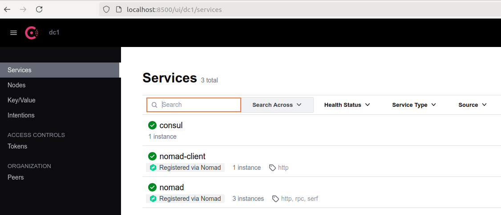
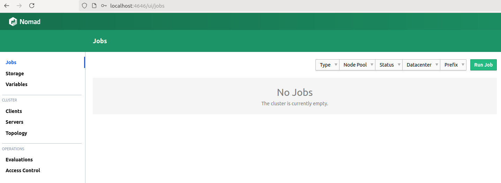
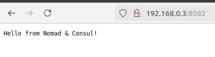
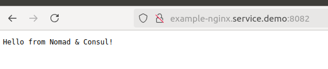
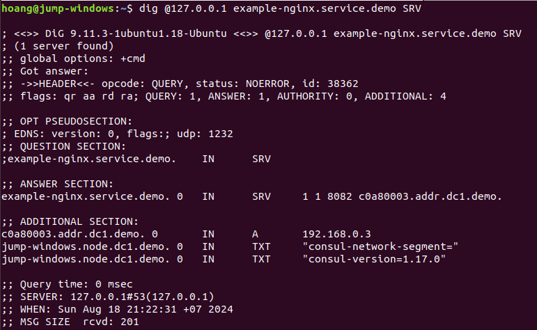
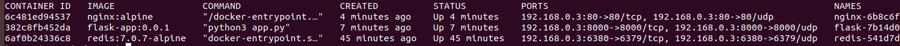
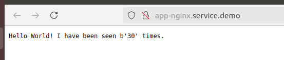

# Nomad experiment

## Setup environment

1. Setup enviroment with consul, dnsmasq and nomad through ansible:
```sh
./ansible_run.sh install.yml
```

Consul status:



Nomad status:



2. Access the UI with ACL:

Consul UI:



Nomad UI:



## Run example nginx job

1. Add `nginx.conf` into consul key/value:
```sh
export CONSUL_HTTP_TOKEN=$(sudo cat /etc/consul.d/data/consul.token | awk '/SecretID/ {print $NF}')

consul kv put example/nginx.conf "events {
    worker_connections 1024;
}

http {
    server {
        listen 8081;
        server_name localhost;

        location / {
            return 200 'Hello from Nomad & Consul!';
            add_header Content-Type text/plain;
        }
    }
}"
```

2. Create `nginx.hcl` job, get `nginx.conf` from consul with template stanza:
```
template {
    data = <<EOF
    {{ key "local/nginx/nginx.conf" }}
    EOF
    destination = "local/nginx.conf"
    change_mode = "restart"
}
```

3. Bind mount `nginx.conf` to containers:
```
config {
    image = "nginx:alpine"
    ports = ["http"]
    volumes = [
        "local/nginx.conf:/etc/nginx/nginx.conf",
    ]
}
```

4. Set port mapping:
```
network {
    port "http" {
        static = 8082
        to = 8081
    }
}
```
In there, `static` is the host port (8082), it's mapping `to` the container port (8081). We have already set the nginx service running on port 8081 in the `nginx.conf` file in consul.

5. Register services to Consul
```
service {
    name = "example-nginx"
    port = "http"
}
```

6. Run job:
```sh
export NOMAD_TOKEN=$(sudo cat /etc/nomad.d/data/nomad.token | awk '/Secret ID/ {print $NF}')
nomad run -detach jobs/example.hcl
```

7. Testing:
```sh
docker ps -a
```

Stdout:
```
CONTAINER ID   IMAGE          COMMAND                  CREATED          STATUS          PORTS                                                            NAMES
afd5f072ed1f   nginx:latest   "/docker-entrypoint.…"   30 seconds ago   Up 29 seconds   80/tcp, 192.168.0.3:8082->8081/tcp, 192.168.0.3:8082->8081/udp   nginx-1c0ad89d-494c-becc-4a90-b694545fb4ca
```

Go to the brower: http://192.168.0.3:8082



Or you can access through consul service with format: `<service_name>.service.<consul_domain>`

Go to the brower: http://example-nginx.service.demo:8082



Validate the DNS record:

```sh
dig @127.0.0.1 example-nginx.service.demo SRV
```


## Run microservice jobs

In this the tutorial, we will deploy the flask app, redis cache with nginx gateway.

- One nginx which redirect 80 --> flask app on 8000
- Flask app, which records in a redis database a number of view
- A redis database, on port 6380

Note that services communicate with each other through the `host` network.

1. Build flask app docker image on nodes running nomad:
```sh
make build
```

2. Put configs to Consul KV:
```sh
export CONSUL_HTTP_TOKEN=$(sudo cat /etc/consul.d/data/consul.token | awk '/SecretID/ {print $NF}')

consul kv put NGINX_CONFIG "
worker_processes 1;

events { worker_connections 1024; }

http {
    sendfile on;
    server {
        listen 80;
        location / {
            proxy_pass http://app-flask.service.demo:8000;
            add_header Content-Type text/plain;
        }
    }
}"

consul kv put REDIS_URL "redis://db-redis.service.demo:6380/0"
```

3. Run nomad jobs:
```sh
nomad run -detach jobs/redis.hcl
nomad run -detach jobs/webapp.hcl
```

4. Testing:

Check docker containers
```sh
docker ps -a
```


Go to the brower: http://app-nginx.service.demo



It's working.
