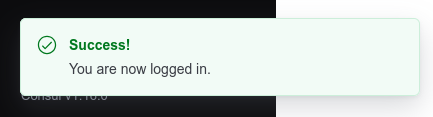
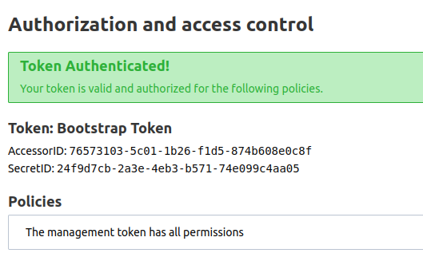
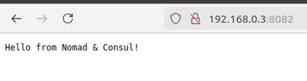

# Nomad experiment

## Create systemd service (nomad & consul)

1. Create token:
```sh
cat /proc/sys/kernel/random/uuid > secrets/consul.token
cat /proc/sys/kernel/random/uuid > secrets/nomad.token
```

2. Set consul token for nomad in `etc/nomad.d/nomad.hcl` file:
```sh
cat secrets/consul.token
```
Then filling the token into this block:
```
consul {
  address = "0.0.0.0:8500"
  token = "a14115ca-5fc8-461d-8ad3-f0a1acdacc0d"
}
```

3. Create systemd service:
```sh
sudo cp -r etc/* /etc/
```

## Deploy consul

1. Run consul with ACL mode (authen):
```sh
sudo systemctl enable consul
sudo systemctl restart consul
sudo systemctl status consul
```

2. Create consul ACL token:
```sh
consul acl bootstrap secrets/consul.token
```
Stdout:
```
AccessorID:       0dff13d5-41da-64c0-6109-049b3126c9ea
SecretID:         a14115ca-5fc8-461d-8ad3-f0a1acdacc0d
Description:      Bootstrap Token (Global Management)
Local:            false
Create Time:      2024-08-12 23:36:21.828024303 +0700 +07
Policies:
   00000000-0000-0000-0000-000000000001 - global-management
```

3. Access the consul UI with ACL token



## Deploy nomad

1. Run nomad with ACL mode (authen):
```sh
sudo systemctl enable nomad
sudo systemctl restart nomad
sudo systemctl status nomad
```

2. Check nomad status:
```sh
nomad status
```
And you can see the error: `Error querying jobs: Unexpected response code: 403 (Permission denied)`

3. Create nomad ACL token:
```sh
nomad acl bootstrap secrets/nomad.token
```
Stdout:
```
Accessor ID  = 76573103-5c01-1b26-f1d5-874b608e0c8f
Secret ID    = 24f9d7cb-2a3e-4eb3-b571-74e099c4aa05
Name         = Bootstrap Token
Type         = management
Global       = true
Create Time  = 2024-08-12 17:26:38.786045974 +0000 UTC
Expiry Time  = <none>
Create Index = 11
Modify Index = 11
Policies     = n/a
Roles        = n/a
```

4. Access the nomad UI with ACL token



Or check nomad status from terminal:

```sh
export NOMAD_TOKEN=$(cat secrets/nomad.token)
nomad status
```
See stdout, it's working:
```
No running jobs
```

## Run example nginx job

1. Add `nginx.conf` into consul:
```sh
export CONSUL_HTTP_TOKEN=$(cat secrets/consul.token)

consul kv put local/nginx/nginx.conf "events {
    worker_connections 1024;
}

http {
    server {
        listen 8081;
        server_name localhost;

        location / {
            return 200 'Hello from Nomad & Consul!';
            add_header Content-Type text/plain;
        }
    }
}"
```

2. Create `nginx.hcl` job, get `nginx.conf` from consul with template stanza:
```
template {
    data = <<EOF
    {{ key "local/nginx/nginx.conf" }}
    EOF
    destination = "local/nginx.conf"
    change_mode = "restart"
}
```

3. Bind mount `nginx.conf` to containers:
```
config {
    image = "nginx:latest"
    ports = ["http"]
    mount {
        type   = "bind"
        source = "local"
        target = "/etc/nginx"
    }
}
```

4. Set port mapping:
```
network {
    port "http" {
        static = 8082
        to = 8081
    }
}
```
In there, `static` is the host port (8082), it's mapping `to` the container port (8081). We have already set the nginx service running on port 8081 in the `nginx.conf` file in consul.

5. Run job:
```sh
nomad run jobs/nginx.hcl
```

6. Testing:
```sh
docker ps -a
```

Stdout:
```
CONTAINER ID   IMAGE          COMMAND                  CREATED          STATUS          PORTS                                                            NAMES
afd5f072ed1f   nginx:latest   "/docker-entrypoint.…"   30 seconds ago   Up 29 seconds   80/tcp, 192.168.0.3:8082->8081/tcp, 192.168.0.3:8082->8081/udp   nginx-1c0ad89d-494c-becc-4a90-b694545fb4ca
```

Go to the brower: http://192.168.0.3:8082


