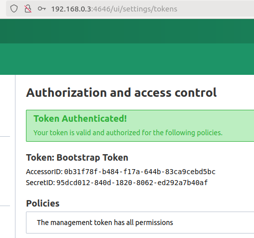

# Nomad experiment

1. Run nomad with ACL mode (authen):
```sh
nomad agent -dev -bind 0.0.0.0 -network-interface='{{ GetDefaultInterfaces | attr "name" }}' -acl-enabled
```

2. Check nomad status:
```sh
nomad status
```
And you can see the error: `Error querying jobs: Unexpected response code: 403 (Permission denied)`

3. Create ACL token:
```sh
cat /proc/sys/kernel/random/uuid > secrets/root.token
nomad acl bootstrap secrets/root.token
```
Stdout:
```
Accessor ID  = 0b31f78f-b484-f17a-644b-83ca9cebd5bc
Secret ID    = 95dcd012-840d-1820-8062-ed292a7b40af
Name         = Bootstrap Token
Type         = management
Global       = true
Create Time  = 2024-08-11 15:12:21.308051201 +0000 UTC
Expiry Time  = <none>
Create Index = 13
Modify Index = 13
Policies     = n/a
Roles        = n/a
```

4. Access the UI with ACL token



Or check nomad status from terminal:

```sh
NOMAD_TOKEN=95dcd012-840d-1820-8062-ed292a7b40af nomad status
```
See stdout, it's working:
```
No running jobs
```